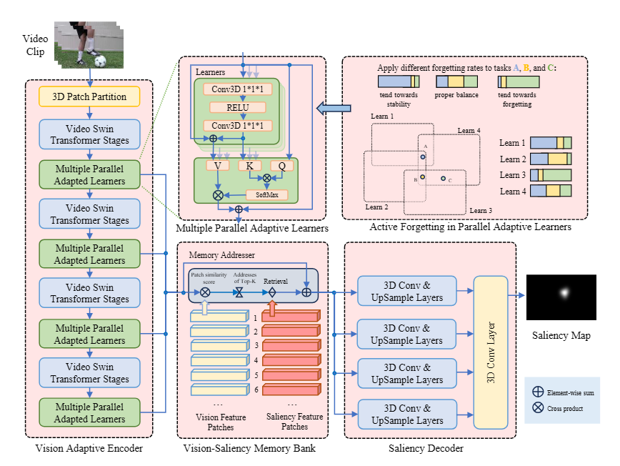

# BVSCL: A Biologically-inspired Visual Saliency Prediction Model for Continual learning

Offical implemention of the paper BVSCL: A Biologically-inspired Visual Saliency Prediction Model for Continual learning

